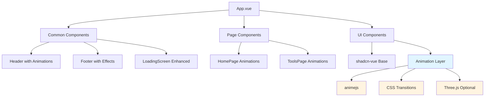

# System Design & Architecture

## Architecture Overview
**What is the high-level system structure?**

The UI refactoring will enhance existing components without changing the core architecture. The design follows a layered approach:



**Key components and their responsibilities:**
- **Animation Layer**: Composable utilities for common animations (fade-in, slide, parallax)
- **Visual Effects**: Reusable components for particles, gradients, 3D backgrounds
- **Enhanced Components**: Existing components with added animations and visual polish
- **Performance Monitor**: Utilities to ensure animations don't degrade performance

**Technology stack choices and rationale:**
- **animejs** (already in dependencies): Lightweight, performant 2D animations library
- **CSS Transitions/Animations**: Native browser animations for simple effects (better performance)
- **Three.js** (optional): Only for specific hero section 3D effects if needed
- **Tailwind CSS 4**: Extend existing utility classes for animation utilities
- **Vue 3 Composition API**: Create reusable animation composables

## Data Models
**What data do we need to manage?**

No new data models required. This is a UI-only enhancement. However, we may need:

**Animation State Management:**
- Component-level animation state (isAnimating, animationComplete)
- User preferences (respects prefers-reduced-motion)
- Performance metrics (frame rate, animation duration)

**Configuration Objects:**
```typescript
interface AnimationConfig {
  duration: number
  easing: string
  delay?: number
  direction?: 'normal' | 'reverse' | 'alternate'
  respectReducedMotion: boolean
}

interface VisualEffectConfig {
  type: 'particles' | 'gradient' | '3d' | 'none'
  intensity: 'low' | 'medium' | 'high'
  performance: 'auto' | 'high' | 'low'
}
```

## API Design
**How do components communicate?**

No new APIs. Enhancements use existing Vue patterns:

**Composables Interface:**
```typescript
// app/composables/animations/useFadeIn.ts
export function useFadeIn(options?: AnimationConfig) {
  const isVisible = ref(false)
  const elementRef = ref<HTMLElement>()
  
  const start = () => { /* animation logic */ }
  const stop = () => { /* cleanup */ }
  
  return { isVisible, elementRef, start, stop }
}

// app/composables/animations/useParallax.ts
export function useParallax(speed: number = 0.5) {
  const offset = ref(0)
  // parallax logic
  return { offset }
}
```

**Component Props (extending existing):**
- No breaking changes to existing props
- Optional animation props can be added:
  ```typescript
  interface EnhancedComponentProps {
    // existing props...
    animation?: 'fade' | 'slide' | 'scale' | 'none'
    animationDelay?: number
    respectReducedMotion?: boolean
  }
  ```

## Component Breakdown
**What are the major building blocks?**

### Frontend Components

**New Animation Composables** (`app/composables/animations/`):
- `useFadeIn.ts` - Fade-in animation utility
- `useSlideIn.ts` - Slide-in animation utility
- `useParallax.ts` - Parallax scroll effect
- `useHoverEffect.ts` - Hover animation utilities
- `useScrollReveal.ts` - Reveal on scroll animations
- `useAnimationPerformance.ts` - Performance monitoring

**New Visual Effect Components** (`app/components/effects/`):
- `ParticleBackground.vue` - Optional particle system background
- `GradientMesh.vue` - Animated gradient mesh background
- `ThreeScene.vue` - Optional Three.js 3D scene wrapper (if needed)

**Enhanced Existing Components**:
- `app/components/common/Header.vue` - Add smooth menu transitions, hover effects
- `app/components/common/Footer.vue` - Add subtle animations on load
- `app/components/common/LoadingScreen.vue` - Enhanced loading animation
- `app/components/home/Hero.vue` - Add parallax, fade-in, particle effects
- `app/components/home/WhatWeDo.vue` - Add scroll-reveal animations
- `app/components/home/AboutUs.vue` - Add fade-in on scroll
- `app/components/home/Testimonials.vue` - Add carousel/slide animations
- `app/components/home/FAQ.vue` - Enhance accordion animations
- `app/components/tools/ToolsGrid.vue` - Add card hover effects
- `app/components/ui/*` - Enhance shadcn-vue components with subtle animations

**CSS Enhancements** (`app/assets/css/`):
- Extend `tailwind.css` with custom animation utilities
- Add animation keyframes for common effects
- Performance-optimized animation classes

### Backend Services/Modules
- None required (UI-only enhancement)

### Third-party Integrations
- **animejs**: Already in dependencies, use for complex animations
- **Three.js** (optional): Only if 3D effects are needed for hero section
- **@vueuse/core**: Already in dependencies, use for scroll/intersection observers

## Design Decisions
**Why did we choose this approach?**

**1. Incremental Enhancement Strategy**
- **Decision**: Enhance existing components rather than rebuilding
- **Rationale**: Maintains stability, allows gradual rollout, easier testing
- **Alternative considered**: Complete redesign (rejected - too risky, breaks existing functionality)

**2. Composables for Animation Logic**
- **Decision**: Create reusable animation composables
- **Rationale**: DRY principle, consistent animations across components, easier maintenance
- **Alternative considered**: Inline animation code (rejected - harder to maintain, inconsistent)

**3. CSS-first, JS-second Approach**
- **Decision**: Use CSS transitions for simple effects, animejs for complex animations
- **Rationale**: Better performance for simple animations, GPU acceleration, smaller bundle impact
- **Alternative considered**: All JS animations (rejected - worse performance, larger bundle)

**4. Optional Three.js Integration**
- **Decision**: Make Three.js optional, only for specific hero effects
- **Rationale**: Three.js adds significant bundle size, only use if needed for wow factor
- **Alternative considered**: Always include Three.js (rejected - unnecessary for most pages)

**5. Performance-first Design**
- **Decision**: Monitor and optimize animations for 60fps
- **Rationale**: Smooth animations are critical for user experience
- **Implementation**: Use `requestAnimationFrame`, GPU-accelerated properties, respect reduced motion

**Patterns and principles applied:**
- **Progressive Enhancement**: Animations enhance but don't break if disabled
- **Accessibility First**: All animations respect `prefers-reduced-motion`
- **Performance Budget**: Monitor bundle size and animation performance
- **Component Composition**: Build complex animations from simple composables

## Non-Functional Requirements
**How should the system perform?**

**Performance targets:**
- Animation frame rate: 60fps on desktop, 30fps minimum on mobile
- Bundle size increase: < 50KB (excluding optional Three.js)
- Animation start delay: < 100ms after component mount
- No layout shifts during animations (CLS < 0.1)

**Scalability considerations:**
- Animation composables should be tree-shakeable
- Lazy load heavy animation libraries (Three.js) only when needed
- Support for disabling animations on low-end devices

**Security requirements:**
- No security impact (UI-only enhancement)
- Ensure animation libraries are up-to-date and secure

**Reliability/availability needs:**
- Animations should gracefully degrade if libraries fail to load
- Fallback to CSS-only animations if JS fails
- No impact on core functionality if animations are disabled

**Accessibility requirements:**
- All animations respect `prefers-reduced-motion: reduce`
- Provide option to disable animations in user preferences (future)
- Ensure animations don't cause motion sickness
- Maintain keyboard navigation during animations
