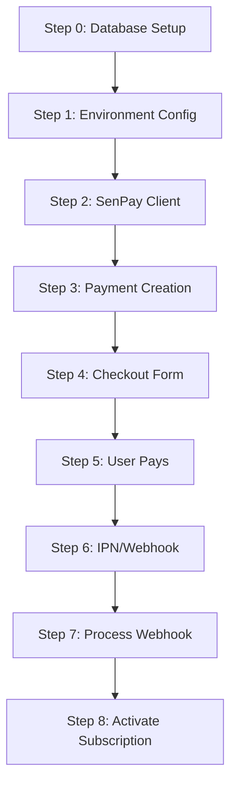

# 📋 Tổng hợp các bước xử lý khi code SenPay Integration

## 🎯 Mục tiêu

Tích hợp SenPay Payment Gateway vào hệ thống, thay thế hoàn toàn MoMo. Tài liệu này tổng hợp các bước xử lý khi code theo thứ tự từng bước.

**Tài liệu tham khảo:**
- SenPay API Documentation: https://developer.sepay.vn/vi/cong-thanh-toan/API/tong-quan
- SenPay Webhooks Guide: https://docs.sepay.vn/tich-hop-webhooks.html

---

## 📊 Tổng quan quy trình



---

## 🔧 Step 0: Database Setup & Configuration

### 0.1: Cấu hình Database để lưu thông tin giao dịch

**Mục đích:** Tạo bảng hoặc cập nhật bảng `payments` để lưu thông tin giao dịch từ SenPay Webhook

**Theo SenPay documentation, khuyến nghị tạo bảng `tb_transactions` với các fields:**

| Field | Type | Mô tả | Nguồn từ Webhook |
|-------|------|-------|------------------|
| `id` | int(11) PK | ID duy nhất | Auto increment |
| `gateway` | varchar(100) | Brand name ngân hàng | `gateway` |
| `transaction_date` | timestamp | Ngày giờ giao dịch | `transaction_date` |
| `account_number` | varchar(100) | Số tài khoản nhận tiền | `account_number` |
| `sub_account` | varchar(250) | Tài khoản phụ | `sub_account` |
| `amount_in` | decimal(20,2) | Số tiền chuyển vào | `amount_in` |
| `amount_out` | decimal(20,2) | Số tiền chuyển ra | `amount_out` |
| `accumulated` | decimal(20,2) | Số dư sau giao dịch | `accumulated` |
| `code` | varchar(250) | Mã thanh toán | `code` |
| `transaction_content` | text | Nội dung chuyển khoản | `transaction_content` |
| `reference_number` | varchar(255) | Mã tham chiếu | `reference_number` |
| `body` | text | Toàn bộ nội dung request | `body` |
| `created_at` | timestamp | Thời gian tạo | Auto |

**Lựa chọn implementation:**

**Option 1: Sử dụng bảng `payments` hiện có (Recommended)**
- Thêm các fields SenPay vào `payments.transaction_data` (JSONB)
- Không cần tạo bảng mới
- Dễ maintain và query

**Option 2: Tạo bảng `senpay_transactions` riêng**
- Tạo migration mới
- Lưu trữ chi tiết hơn
- Có thể query riêng cho SenPay transactions

**Code example (Option 1 - Recommended):**

```ruby
# db/migrate/XXXXXX_add_senpay_fields_to_payments.rb
class AddSenpayFieldsToPayments < ActiveRecord::Migration[8.0]
  def change
    # transaction_data (JSONB) đã có sẵn, chỉ cần đảm bảo structure
    # Có thể thêm index cho idempotency check
    add_index :payments, "(transaction_data->>'order_invoice_number')",
              name: "idx_payments_order_invoice_number"
  end
end
```

**Lưu ý quan trọng về Idempotency:**
- ⚠️ **Bắt buộc**: Kiểm tra duplicate transactions
- SenPay có retry mechanism → có thể gửi duplicate webhooks
- Kiểm tra bằng: `transaction_id` hoặc kết hợp `reference_number`, `amount_in`, `transaction_date`
- Nếu không check duplicate → có thể xử lý một transaction nhiều lần

---

## 🔐 Step 1: Environment Configuration

### 1.1: Cấu hình Environment Variables

**Mục đích:** Thêm SenPay credentials vào `.env` files

**Các biến môi trường cần thiết:**

```bash
# SenPay Payment Gateway Configuration (Sandbox)
SENPAY_MERCHANT_ID=your_merchant_id_here
SENPAY_SECRET_KEY=your_secret_key_here
SENPAY_API_URL=https://pgapi-sandbox.sepay.vn
SENPAY_CHECKOUT_URL=https://pay-sandbox.sepay.vn/v1/checkout/init
SENPAY_REDIRECT_URL=http://localhost:3000/payment/return
SENPAY_WEBHOOK_URL=https://xxxx.ngrok.io/webhooks/senpay
```

**Các bước:**

1. **Cập nhật `.env.example`:**
   ```bash
   # SenPay Payment Gateway Configuration
   SENPAY_MERCHANT_ID=
   SENPAY_SECRET_KEY=
   SENPAY_API_URL=
   SENPAY_CHECKOUT_URL=
   SENPAY_REDIRECT_URL=
   SENPAY_WEBHOOK_URL=
   ```

2. **Cập nhật `.env.development`:**
   - Thêm các biến với giá trị thực (sau khi lấy từ SenPay Dashboard)

3. **Tạo initializer:**
   - Tạo `config/initializers/senpay.rb`
   - Load và validate SenPay credentials

**Code example:**

```ruby
# config/initializers/senpay.rb
Rails.application.config.after_initialize do
  required_vars = %w[
    SENPAY_MERCHANT_ID
    SENPAY_SECRET_KEY
  ]

  missing_vars = required_vars.reject { |var| ENV[var].present? }

  if missing_vars.any? && Rails.env.production?
    Rails.logger.error("Missing required SenPay environment variables: #{missing_vars.join(', ')}")
    raise "Missing required SenPay environment variables: #{missing_vars.join(', ')}"
  elsif missing_vars.any?
    Rails.logger.warn("Missing SenPay environment variables (optional in #{Rails.env}): #{missing_vars.join(', ')}")
  end

  Rails.application.config.senpay = {
    merchant_id: ENV.fetch("SENPAY_MERCHANT_ID", nil),
    secret_key: ENV.fetch("SENPAY_SECRET_KEY", nil),
    api_url: ENV.fetch("SENPAY_API_URL", nil),
    checkout_url: ENV.fetch("SENPAY_CHECKOUT_URL", nil),
    redirect_url: ENV.fetch("SENPAY_REDIRECT_URL", nil),
    webhook_url: ENV.fetch("SENPAY_WEBHOOK_URL", nil),
  }
end
```

---

## 🔑 Step 2: SenPay Client Service

### 2.1: Tạo SenPay Client

**Mục đích:** Tạo service để giao tiếp với SenPay API

**File:** `app/services/senpay/client.rb`

**Các method cần implement:**

1. **`initialize`**: Load credentials từ ENV
2. **`build_signature(params)`**: Generate signature (HMAC SHA256 + Base64)
3. **`create_payment_request(params)`**: Tạo payment request với form data
4. **`verify_webhook_signature(params, signature)`**: Verify webhook signature
5. **`query_order_status(order_id)`**: Query order status từ SenPay API

**Code structure:**

```ruby
# app/services/senpay/client.rb
class Senpay::Client < BaseService
  def initialize
    @merchant_id = ENV.fetch("SENPAY_MERCHANT_ID")
    @secret_key = ENV.fetch("SENPAY_SECRET_KEY")
    @api_url = ENV.fetch("SENPAY_API_URL")
    @checkout_url = ENV.fetch("SENPAY_CHECKOUT_URL")
  end

  def build_signature(params)
    # 1. Build signature string từ params (theo thứ tự SenPay quy định)
    # 2. Generate HMAC SHA256 với secret_key
    # 3. Encode Base64
    # 4. Return signature
  end

  def create_payment_request(params)
    # 1. Build form params
    # 2. Generate signature
    # 3. Return form data với signature
  end

  def verify_webhook_signature(params, signature)
    # 1. Build expected signature
    # 2. Compare với received signature
    # 3. Return boolean
  end
end
```

**Signature Generation Logic:**

Theo SenPay documentation:
1. Lấy các params cần ký (theo thứ tự SenPay quy định)
2. Build string: `field1=value1&field2=value2&...`
3. Generate HMAC SHA256: `HMAC-SHA256(secret_key, signature_string)`
4. Encode Base64: `Base64.encode(hmac_result)`
5. Return signature

**Code example:**

```ruby
def build_signature(params)
  # 1. Sort params theo thứ tự SenPay quy định
  sorted_params = params.sort.to_h
  
  # 2. Build signature string
  signature_string = sorted_params.map { |k, v| "#{k}=#{v}" }.join("&")
  
  # 3. Generate HMAC SHA256
  hmac = OpenSSL::HMAC.digest("SHA256", @secret_key, signature_string)
  
  # 4. Encode Base64
  Base64.strict_encode64(hmac)
end
```

**Basic Authentication:**

SenPay sử dụng Basic Authentication cho API calls:
- Header: `Authorization: Basic base64(merchant_id:secret_key)`

**Code example:**

```ruby
def build_auth_header
  credentials = "#{@merchant_id}:#{@secret_key}"
  encoded = Base64.strict_encode64(credentials)
  "Basic #{encoded}"
end
```

---

## 💳 Step 3: Payment Creation Service

### 3.1: Tạo Payment Request

**Mục đích:** Tạo payment record và generate form data để submit đến SenPay

**File:** `app/services/payments/create_payment_service.rb`

**Flow:**

1. **Validate inputs:**
   - User phải tồn tại
   - Subscription plan phải tồn tại và active
   - Payment method phải là "senpay"

2. **Create payment record:**
   - Status: "pending"
   - Amount: từ subscription_plan.price
   - Expired_at: 15 minutes from now
   - Transaction_data: {} (sẽ update sau)

3. **Call SenPay Client:**
   - Build payment params:
     - `merchant`: SENPAY_MERCHANT_ID
     - `order_amount`: payment.amount
     - `order_invoice_number`: payment.id (hoặc unique string)
     - `order_description`: "Subscription: #{plan.name}"
     - `return_url`: SENPAY_REDIRECT_URL
     - `ipn_url`: SENPAY_WEBHOOK_URL
   - Generate signature
   - Return form data

4. **Update payment:**
   - Save form data vào `transaction_data`
   - Save signature

5. **Return result:**
   - Return payment object với form data

**Code example:**

```ruby
def create_senpay_request
  @senpay_client = Senpay::Client.new
  
  payment_params = {
    merchant: ENV.fetch("SENPAY_MERCHANT_ID"),
    order_amount: @payment.amount.to_i,
    order_invoice_number: @payment.id.to_s,
    order_description: "Subscription: #{@subscription_plan.name}",
    return_url: ENV.fetch("SENPAY_REDIRECT_URL"),
    ipn_url: ENV.fetch("SENPAY_WEBHOOK_URL")
  }
  
  form_data = @senpay_client.create_payment_request(payment_params)
  
  @payment.update!(
    transaction_data: {
      form_data: form_data,
      checkout_url: ENV.fetch("SENPAY_CHECKOUT_URL")
    }
  )
end
```

**API Response từ SenPay:**

SenPay **KHÔNG** trả về JSON response. Thay vào đó:
- Nếu signature hợp lệ → SenPay redirect browser đến trang thanh toán
- Nếu signature không hợp lệ → SenPay trả về error page

**Lưu ý:**
- Frontend cần submit HTML form hoặc redirect đến SenPay checkout URL
- Form phải POST đến SenPay checkout URL với tất cả params + signature

---

## 📝 Step 4: Checkout Form Generation

### 4.1: Tạo HTML Form

**Mục đích:** Tạo HTML form với tất cả params và signature để submit đến SenPay

**Có 2 cách:**

**Cách 1: Return form data, frontend tự tạo form**

```ruby
# Backend return form data
{
  checkout_url: "https://pay-sandbox.sepay.vn/v1/checkout/init",
  form_data: {
    merchant: "...",
    order_amount: 100000,
    order_invoice_number: "123",
    signature: "..."
  }
}

# Frontend tạo form và submit
```

**Cách 2: Backend generate HTML form**

```ruby
# Backend generate HTML form
def generate_checkout_form
  form_data = @payment.transaction_data['form_data']
  checkout_url = ENV.fetch("SENPAY_CHECKOUT_URL")
  
  form_html = <<~HTML
    <form id="senpay-form" method="POST" action="#{checkout_url}">
      #{form_data.map { |k, v| "<input type='hidden' name='#{k}' value='#{v}'>" }.join("\n")}
    </form>
    <script>document.getElementById('senpay-form').submit();</script>
  HTML
  
  form_html
end
```

**Recommended:** Cách 1 - Return form data, frontend tự xử lý

---

## 💰 Step 5: User Payment Flow

### 5.1: User thanh toán trên SenPay

**Flow:**

1. User submit form hoặc redirect đến SenPay checkout URL
2. SenPay hiển thị trang thanh toán
3. User chọn phương thức thanh toán và thanh toán
4. SenPay xử lý thanh toán
5. SenPay redirect user về `return_url` (frontend)
6. SenPay gửi IPN/Webhook đến `ipn_url` (backend)

**Lưu ý:**
- `return_url`: Frontend URL để redirect user sau khi thanh toán
- `ipn_url`: Backend URL để nhận webhook callback (phải là HTTPS)

---

## 📨 Step 6: IPN/Webhook Callback

### 6.1: Nhận Webhook từ SenPay

**Mục đích:** Nhận POST request từ SenPay với thông tin giao dịch

**Endpoint:** `POST /webhooks/senpay`

**Request từ SenPay:**

```json
{
  "notification_type": "ORDER_PAID",
  "order": {
    "order_invoice_number": "123",
    "order_amount": 100000,
    "order_status": "CAPTURED"
  },
  "transaction": {
    "id": "transaction_id_123",
    "gateway": "Vietcombank",
    "transaction_date": "2025-11-07T10:00:00Z",
    "amount_in": 100000,
    "code": "ORDER123",
    "reference_number": "REF123",
    "transaction_content": "Thanh toan don hang ORDER123"
  }
}
```

**Response yêu cầu:**

- HTTP Status: **200** (hoặc 201)
- Body: `{"success": true}`
- Nếu không trả về 200 → SenPay sẽ retry

**Code example:**

```ruby
# app/controllers/webhooks/senpay_controller.rb
class Webhooks::SenpayController < ApplicationController
  skip_before_action :verify_authenticity_token
  
  def callback
    result = Payments::ProcessWebhookService.call(webhook_params: webhook_params.to_h)
    
    if result[:success]
      render json: { success: true }, status: :ok
    else
      render json: { success: false, error: result[:error] }, status: :unprocessable_entity
    end
  end
  
  private
  
  def webhook_params
    params.permit(
      :notification_type,
      order: [:order_invoice_number, :order_amount, :order_status],
      transaction: [:id, :gateway, :transaction_date, :amount_in, :code, :reference_number, :transaction_content]
    )
  end
end
```

---

## ✅ Step 7: Process Webhook

### 7.1: Xử lý Webhook Data

**Mục đích:** Verify signature, update payment status, activate subscription

**File:** `app/services/payments/process_webhook_service.rb`

**Flow:**

1. **Verify signature:**
   - Build expected signature từ webhook params
   - Compare với signature từ request
   - Reject nếu không hợp lệ

2. **Find payment:**
   - Tìm payment bằng `order_invoice_number`
   - Reject nếu không tìm thấy

3. **Check idempotency:**
   - Kiểm tra payment đã được processed chưa
   - Skip nếu đã processed (tránh duplicate)

4. **Update payment status:**
   - Nếu `notification_type == "ORDER_PAID"` → status = "success"
   - Nếu khác → status = "failed"
   - Update `transaction_data` với webhook data

5. **Activate subscription:**
   - Nếu payment success → call `Subscriptions::ActivateService`
   - Update user.subscription_plan_id
   - Grant request limit

6. **Return result:**
   - Return `{ success: true }` để SenPay biết đã nhận được

**Code example:**

```ruby
def call
  verify_signature!
  find_payment!
  check_already_processed!
  update_payment_status!
  activate_subscription! if payment_success?
  { success: true, payment: @payment }
rescue StandardError => e
  Rails.logger.error("Webhook processing failed: #{e.class} - #{e.message}")
  { success: false, error: e.message }
end

def verify_signature!
  @senpay_client = Senpay::Client.new
  unless @senpay_client.verify_webhook_signature(@webhook_params)
    raise StandardError, "Invalid webhook signature"
  end
end

def find_payment!
  order_invoice_number = @webhook_params.dig(:order, :order_invoice_number)
  @payment = Payment.find_by(id: order_invoice_number)
  raise StandardError, "Payment not found: #{order_invoice_number}" if @payment.blank?
end

def check_already_processed!
  return unless @payment.success?
  
  Rails.logger.info("Payment #{@payment.id} already processed, skipping")
  raise StandardError, "Payment already processed"
end

def update_payment_status!
  new_status = payment_success? ? "success" : "failed"
  transaction_data_update = extract_transaction_data
  
  @payment.update!(
    status: new_status,
    transaction_data: (@payment.transaction_data || {}).merge(transaction_data_update)
  )
end

def payment_success?
  @webhook_params[:notification_type] == "ORDER_PAID"
end
```

**Idempotency Check:**

```ruby
def check_duplicate_transaction!
  transaction_id = @webhook_params.dig(:transaction, :id)
  
  # Check nếu transaction đã được xử lý
  existing_payment = Payment.where(
    "transaction_data->>'transaction_id' = ?", transaction_id
  ).where(status: "success").first
  
  if existing_payment && existing_payment.id != @payment.id
    Rails.logger.warn("Duplicate transaction detected: #{transaction_id}")
    raise StandardError, "Duplicate transaction"
  end
end
```

---

## 🎁 Step 8: Activate Subscription

### 8.1: Kích hoạt Subscription Plan

**Mục đích:** Activate subscription plan cho user sau khi thanh toán thành công

**File:** `app/services/subscriptions/activate_service.rb`

**Flow:**

1. **Update user subscription:**
   - Set `user.subscription_plan_id = subscription_plan.id`

2. **Calculate expired_at:**
   - `expired_at = Time.current + subscription_plan.duration_days.days`

3. **Grant request limit:**
   - Lấy limit từ `subscription_plan.features['ai_limit']`
   - Grant cho user (có thể track trong `ai_schedule_results`)

4. **Log activation:**
   - Log activation event

**Code example:**

```ruby
def call
  ActiveRecord::Base.transaction do
    activate_subscription!
    log_activation
    { success: true, user: @user }
  end
rescue StandardError => e
  Rails.logger.error("Subscription activation failed: #{e.class} - #{e.message}")
  raise
end

def activate_subscription!
  @user.update!(subscription_plan: @subscription_plan)
end
```

---

## 🔍 Step 9: Query Order Status (Đối soát)

### 9.1: Truy vấn trạng thái đơn hàng

**Mục đích:** Đối soát giao dịch bằng cách query SenPay API

**API Endpoint:**
- **Base URL**: `https://pgapi-sandbox.sepay.vn`
- **Endpoint**: `GET /v1/order/detail/{order_id}`
- **Authentication**: Basic Authentication (merchant_id:secret_key)

**Code example:**

```ruby
def query_order_status(order_id)
  uri = URI("#{@api_url}/v1/order/detail/#{order_id}")
  http = Net::HTTP.new(uri.host, uri.port)
  http.use_ssl = true
  
  request = Net::HTTP::Get.new(uri.path)
  request["Authorization"] = build_auth_header
  request["Content-Type"] = "application/json"
  
  response = http.request(request)
  parse_response(response)
end
```

**Response từ SenPay:**

```json
{
  "data": {
    "order_invoice_number": "123",
    "order_amount": 100000,
    "order_status": "CAPTURED",
    "transaction_id": "..."
  }
}
```

**Lưu ý:**
- `order_status`: "CAPTURED" = thanh toán thành công
- Có thể dùng để đối soát với database

---

## 📋 Tóm tắt các bước

### Bước 0: Database Setup
1. ✅ Tạo migration để thêm SenPay fields (hoặc dùng transaction_data JSONB)
2. ✅ Add indexes cho idempotency check

### Bước 1: Environment Configuration
1. ✅ Thêm SenPay variables vào `.env.example`
2. ✅ Thêm SenPay variables vào `.env.development`
3. ✅ Tạo `config/initializers/senpay.rb`

### Bước 2: SenPay Client Service
1. ✅ Tạo `app/services/senpay/client.rb`
2. ✅ Implement Basic Authentication
3. ✅ Implement signature generation (HMAC SHA256 + Base64)
4. ✅ Implement `create_payment_request`
5. ✅ Implement `verify_webhook_signature`

### Bước 3: Payment Creation Service
1. ✅ Update `Payments::CreatePaymentService`
2. ✅ Thay `create_momo_request` → `create_senpay_request`
3. ✅ Generate form data với signature
4. ✅ Return form data cho frontend

### Bước 4: Checkout Form
1. ✅ Frontend nhận form data từ backend
2. ✅ Frontend tạo HTML form hoặc redirect
3. ✅ Submit form đến SenPay checkout URL

### Bước 5: User Payment
1. ✅ User thanh toán trên SenPay
2. ✅ SenPay redirect về return_url
3. ✅ SenPay gửi webhook đến ipn_url

### Bước 6: IPN/Webhook Callback
1. ✅ Tạo `Webhooks::SenpayController`
2. ✅ Implement `callback` action
3. ✅ Return HTTP 200 với `{"success": true}`

### Bước 7: Process Webhook
1. ✅ Tạo `Payments::ProcessWebhookService`
2. ✅ Verify signature
3. ✅ Find payment by order_invoice_number
4. ✅ Check idempotency (duplicate check)
5. ✅ Update payment status
6. ✅ Activate subscription nếu success

### Bước 8: Activate Subscription
1. ✅ Call `Subscriptions::ActivateService`
2. ✅ Update user.subscription_plan_id
3. ✅ Grant request limit

### Bước 9: Query Order Status (Optional)
1. ✅ Implement `query_order_status` trong SenPay Client
2. ✅ Dùng để đối soát giao dịch

---

## 🔗 Links tham khảo

- **SenPay API Documentation**: https://developer.sepay.vn/vi/cong-thanh-toan/API/tong-quan
- **SenPay Webhooks Guide**: https://docs.sepay.vn/tich-hop-webhooks.html
- **ngrok**: https://ngrok.com/
